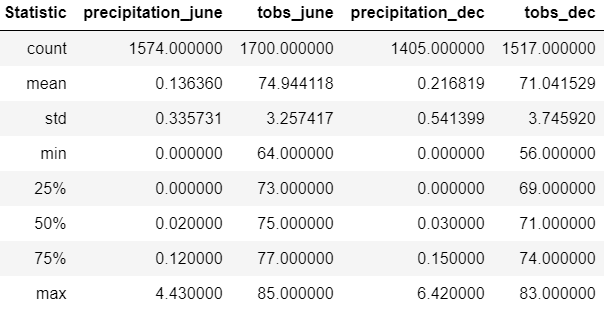

# Surf's Up Analysis Report

## Background and Results
W. Avy and another investor are interesed in financially supporting the opening of 
a surf and ice cream shop on the island of Oahu.  They have asked for information 
concerning weather data and stations from around the Hawaiian islands.

### Purpose
Pull temperature and rainfall data from a SQLite weather database to perform an 
analyisis to determine if there will be enough fine weather to draw customers to
the new shop.

### Technical Analysis
Use SQLAlchemy to reflect data from the SQLite. Print some plots of the data for 
visualization.  Use Flask to build an API so investors can view the data just 
using a URL.

### Results
Mr. Avy asked for weather data specifically for the months of June and December.
From the chart below, it can be shown that the weather differences between 
these two months are minimal.
- Rainfall difference is only 0.5 inches.
- Rainfall average for December is 2 inches higher than June.
- High temperature is only two degrees different.
- Low temperature is the datum with the larger difference but it is only 8 degrees.
- Average temperature is only 4 degrees different with June being the hottest.

We can infer from this that Hawaii has terrific year-round weather.

## Resources
Data Sources:

Hawaii.sqlite - weather database

Software:

Pyton 3.7.6
Jupyter Notebook 6.0.3
Pandas 1.0.1
Numpy 1.18.1
sqlalchemy 1.3.18
SQLite
Flask
VS Code

## Recommendations and Next Steps

### Recommendations for Future Analysis
- Further expand the analysis to include all months of the year so that any seasonal
    differences can be visualized, especially rainfall which can put a damper on ice consumption.
    Possibly plot the rainfall data by month over the time-period in the database.
- It would also be helpful to narrow the stations used in the analysis to only the stations near
    the proposed site of the new shop.  This would give a more accurate view of the weather there.
- Expand the station analysis to other stations near possible locations for a second shop.
